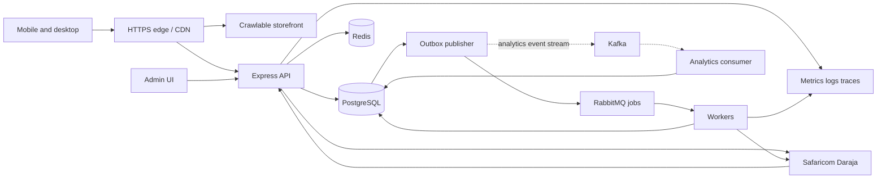

# Proposed architecture

Status: draft. Preserve the existing backend as a modular monolith with separately deployed workers. Do not split commerce into microservices before ownership and scaling evidence justify it.

Dashed paths show the analytics pipeline, required for the December learning deliverable; production placement remains unresolved. The outbox publisher needs independent delivery state per destination if both brokers are used. Broker acknowledgment is not proof of completed business processing.

## Components and boundaries

- Storefront: mobile-first, crawlable category/product HTML with stable URLs. Decide SSR framework versus generated pages in BAP-002; retain working UI behavior through migration. Serve optimized images/assets through object storage and CDN.
- API modules: catalog, inventory, checkout/orders, payments, identity/admin, delivery, notifications, analytics. Business rules belong in services with transaction boundaries, not UI.
- PostgreSQL: authoritative products, stock, orders, payments, access control, audit, outbox, and reporting aggregates. Local PostgreSQL is the zero-budget development baseline; durable production hosting is unresolved.
- Redis: bounded catalog cache, rate-limit counters, optional sessions. Explicit TTL/invalidation; no authoritative inventory or payment state. Cache failure policy defined per use: reads can fall back; admin authentication fails closed when its required session store is unavailable.
- RabbitMQ: durable background jobs, acknowledgment after successful processing, bounded retries and dead-letter queues. Do not blindly retry ambiguous payment initiation.
- Kafka (required learning component): versioned domain events for replayable analytics; no PII by default, partition by order ID, consumer deduplication, retention and schema evolution policy.
- Admin: authenticated inventory/order management, scoped roles, audited changes, financial reports. Analytics permissions separate from payment/fulfillment mutation rights.
- Infrastructure: Docker locally and in CI. Kubernetes stages stateless API/workers; durable databases and brokers preferably managed. Compose is a development tool, not evidence of high availability.

## Data model evolution

Product, ProductImage, Category, Inventory, StockReservation, Order, OrderItem, PaymentAttempt, PaymentEvent, DeliveryZone, DeliveryQuote, ExchangeRequest, ExchangeItem, AdminUser/Role, AuditLog, IdempotencyKey, OutboxEvent, and AnalyticsAggregate. Guest checkout is the release baseline; customer accounts are deferred. Store currency and integer KES amounts explicitly. Snapshot item names/prices and delivery charges at checkout. Track payment and fulfillment independently. Add indexes for product slugs, order creation/status, provider checkout ID, receipt uniqueness where applicable, and unpublished outbox rows.

Replace one payment transaction per order with multiple attempts. Preserve existing history in additive/backfilled migrations before removing old fields. Define reservation expiry and release behavior; payment arriving after expiry requires a documented manual resolution or fulfillment/refund workflow. Never silently oversell.

## Order and payment workflow

1. Validate customer/items/delivery, authorize where needed, rate limit and resolve idempotency key.
2. Transactionally price from DB, reserve stock, create order/attempt and outbox record. Same key/body replays the result; same key/different body returns conflict.
3. Initiate STK with timeouts and validated provider response. Persist accepted request IDs. Ambiguous acceptance becomes UNKNOWN, requiring query/reconciliation before another prompt.
4. Authenticate callback access, validate shape, correlate attempt/request/amount/currency against authoritative expectations. URL HMAC is a capability, not a body signature from Safaricom. Provider verification strategy must follow current merchant/API capabilities.
5. Deduplicate receipt/event and enforce legal transitions in a transaction. Duplicate processing has no duplicate inventory, revenue, or notification effect. A late failure cannot revert a settled success.
6. Transactional outbox schedules fulfillment/notifications/analytics. Consumers handle at-least-once delivery idempotently.
7. Reconciliation queries stale accepted attempts and flags unresolved mismatches for admin intervention. Financial reports use settled authoritative records.

Proposed attempt states: CREATED → INITIATING → ACCEPTED → SUCCEEDED / FAILED / CANCELLED; UNKNOWN captures ambiguous initiation. Order payment aggregation is separate from each attempt. Routine refunds are excluded by merchant policy; exchanges and exceptional payment corrections are separately auditable.

## API contracts to specify before implementation

Versioned OpenAPI document with request/response schemas, auth, error codes and pagination. Include catalog/product lookup, idempotent order creation, scoped order/payment lookup, explicit payment retry, provider callback, admin catalog/inventory/orders, analytics reports, and liveness/readiness. Existing `/api/orders` remains compatible during frontend transition. Price/stock conflicts return actionable UI errors. Never expose credentials or full provider diagnostic bodies to shoppers.

## Sources and decisions

- [Daraja official API portal](https://developer.safaricom.co.ke/apis): confirm merchant-specific API/onboarding details during payment work.
- [Kubernetes production guidance](https://kubernetes.io/docs/setup/production-environment/): account for control plane, availability, and operational ownership.
- [Google ecommerce structure](https://developers.google.com/search/docs/specialty/ecommerce/help-google-understand-your-ecommerce-site-structure): crawlable navigation and product links inform storefront design.

Exact service versions, hosting and frontend framework remain undecided; record them in ADRs with support/cost constraints before implementation.

## Business integration update: 6 October 2026

NCBA paybill 880100 is a shared bank collection channel, according to [NCBA corporate collection documentation](https://ncbagroup.com/wp-content/uploads/sites/2/securepdfs/2025/02/Key-Facts-Document-Corporate-20.07.pdf). The merchant collection reference must be configured separately from internal order references. Current `formatDarajaReferences()` derives AccountReference from order ID; do not simply set SHORTCODE to 880100 and assume settlement routes to this business. Confirm the bank-supported request fields, STK authorization and reconciliation identifiers first. Keep a payment-provider adapter boundary so authorized NCBA integration can replace direct Daraja transport without rewriting order/payment invariants. No live configuration change is authorized by documenting the destination.

Delivery is Mombasa-only initially. Pickup Mtaani/customer-specific transport is quote-based, typically KES 300–400. Model DeliveryQuote with amount, recipient, agreed arrangement, status, expiry and customer acceptance. Do not invent a fixed fee or trigger STK for an unagreed total. Pending owner clarification, proposed flow is order request → manager quote → customer acceptance → payment. If transport is paid directly to courier, exclude it from merchant collection/revenue and label it separately; if collected by merchant, snapshot it in the payable total and report product sales separately from transport collections.

Inventory authority is unresolved because an existing inventory system is already used. Choose replacement with reconciled opening balances, or integration with explicit stock authority, product mapping, sync/reconciliation and failure handling. An import snapshot alone does not guarantee availability while local sales continue. Log every stock movement and financial adjustment with actor, reason and linked order; never overwrite totals to hide discrepancies.

Routine refunds are outside the business policy. Add ExchangeRequest/ExchangeItem and inspection/approval states for unused perfume. Returned stock is quarantined until inspection; price differences, transport cost and approval rules remain owner decisions. An exchange is not another full-price sale. Duplicate charges and other payment errors require an auditable exception-resolution process even when routine merchandise refunds are unavailable; never treat excess payment as revenue.
